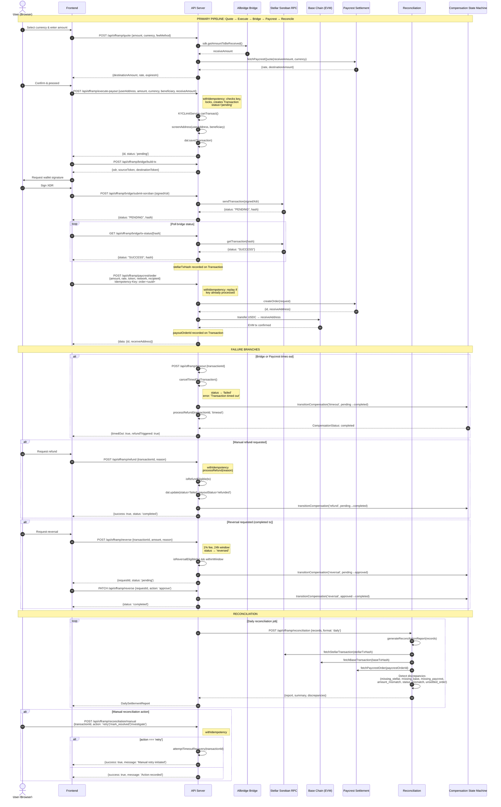

# ADR-014: Offramp Settlement Flow — Quote, Execute-Payout, and Reconciliation

**Status:** Accepted
**Date:** 2026-09-27
**Deciders:** Stellar-Spend core team

---

## Context

The offramp pipeline converts user-held Stellar USDC into fiat currency delivered to a beneficiary bank account. This flow spans multiple services — the Allbridge bridge on Stellar and Base chains, the Paycrest FX/settlement provider, and the internal transaction and reconciliation layers — and must handle failures, timeouts, refunds, and reversals in a coordinated way.

Three specific concerns motivated this ADR:

1. **The pipeline is multi-hop and non-atomic.** A payout moves through quote generation, bridge submission, Paycrest order creation, on-chain USDC transfer, and final reconciliation. A failure at any stage leaves the system in an ambiguous state that must be resolved deterministically.
2. **Retry semantics are distributed.** The `execute-payout` endpoint is wrapped in `withIdempotency`, the `paycrest/order` endpoint uses idempotency keys, and the `timeout`/`refund`/`reverse` endpoints each have their own retry and compensation logic. Without a recorded specification, retries can produce duplicate orders or conflicting compensation states.
3. **Reconciliation is the source of truth for settlement.** The `src/lib/reconciliation.ts` module cross-references Stellar, Base, and Paycrest data to detect discrepancies, but the relationship between reconciliation and the compensation paths (timeout → refund, reverse → approval) is not explicitly documented.

This ADR records the end-to-end settlement pipeline, the trace of a single payout through each stage, the retry/timeout/refund/reverse branches, and the failure semantics that govern them.

Related prior decisions: [ADR-006](./ADR-006-idempotency-implementation.md) records the idempotency key system used across mutating endpoints. [ADR-012](./ADR-012-contract-architecture.md) records the contract architecture that the offramp bridges interact with on-chain. This ADR records _how the offramp flow executes_ and _how it recovers from failure_.

---

## Decision

### 1. The pipeline: quote → execute-payout → reconciliation

The offramp settlement flow follows a strict linear pipeline with compensating branches at each stage:

**Stage 1 — Quote (`POST /api/offramp/quote`):**
The client submits `{ amount, currency, feeMethod, sourceAddress }`. The server:
1. Validates the currency via `isSupportedCurrency`.
2. Optionally screens the source address via `screenAddress`.
3. Calculates the bridge amount using `calculateBridgeAmount` (applying the `STABLECOIN_FEE` of `0.5` for stablecoin fee methods).
4. Initializes the Allbridge SDK, discovers Stellar and Base chain details, and calls `sdk.getAmountToBeReceived` to determine the receive amount on Base.
5. Fetches the FX rate from Paycrest via `fetchPaycrestQuote(receiveAmount, currency)`.
6. Builds and returns a quote via `buildQuote(destinationAmount, rate, currency, '0', '0', 300)`.

The quote is valid for 300 seconds and is the basis for the next stage. The quote endpoint does **not** create a transaction record — it is a read-only pricing call.

**Stage 2 — Execute Payout (`POST /api/offramp/execute-payout`):**
The client submits `{ userAddress, amount, currency, beneficiary, receiveAmount, feeMethod }`. The server:
1. Wraps the entire handler in `withIdempotency` to protect against duplicate execution on network retries.
2. Validates the body against `executePayoutSchema`.
3. Checks KYC limits via `KYCLimitService.canTransact`.
4. Screens both the source address and the beneficiary account via `screenAddress` (fail-closed for high-value transactions).
5. Computes fee breakdown via `calculateAllFees`.
6. Creates a `Transaction` record with `status: 'pending'` and saves it to the database via `dal.save`.
7. Records the transaction for KYC limit tracking via `KYCLimitService.recordTransaction`.
8. Returns `{ id, status: 'pending' }`.

The transaction is now in the system as a pending record. The actual on-chain and Paycrest operations happen asynchronously after this point.

**Stage 3 — Bridge Submission (implicit, post-execute):**
After `execute-payout` returns, the server submits the swap/bridge transaction to Soroban via `POST /api/offramp/bridge/submit-soroban`. The client polls `GET /api/offramp/bridge/tx-status/[hash]` until the bridge reaches a terminal state (`completed`, `failed`, `expired`). The transaction's `bridgeStatus` and `stellarTxHash` fields are updated accordingly.

**Stage 4 — Paycrest Order (`POST /api/offramp/paycrest/order`):**
Once the bridge completes, the server creates a Paycrest payout order via `POST /api/offramp/paycrest/order`, which is also wrapped in `withIdempotency`. The order includes `{ amount, rate, token, network, reference, returnAddress, recipient }`. Paycrest returns `{ id, receiveAddress }`. The server then transfers USDC to the Paycrest receive address on Base. The transaction's `payoutOrderId` is set.

**Stage 5 — Reconciliation (`POST /api/offramp/reconciliation`):**
The reconciliation pipeline (`src/lib/reconciliation.ts`) cross-references the transaction's `stellarTxHash`, `baseTxHash`, and `paycrestOrderId` against their respective external systems:
- `fetchStellarTransaction` queries the Stellar Horizon API.
- `fetchBaseTransaction` queries the Base EVM RPC.
- `fetchPaycrestOrder` queries the Paycrest API.

It detects discrepancies of type `missing_stellar`, `missing_base`, `missing_paycrest`, `amount_mismatch`, `status_mismatch`, or `unsettled_order`, and generates alerts when thresholds are exceeded.

**Stage 6 — Daily Settlement:**
`buildDailySettlementReport` aggregates records by day and produces a `DailySettlementReport` with volumes, matched counts, discrepancies, and unsettled orders. Manual reconciliation (`POST /api/offramp/reconciliation/manual`) allows operators to `retry`, `mark_resolved`, or `investigate` individual transactions.

### 2. Trace: a single payout end-to-end

A single payout traces through the following call path:

```
offramp/quote → offramp/execute-payout → offramp/bridge/submit-soroban → offramp/paycrest/order → daily-reconciliation
```

Step-by-step:

1. **`offramp/quote`** receives `{ amount, currency, feeMethod }`, calls Allbridge `getAmountToBeReceived` and Paycrest `fetchPaycrestQuote`, returns a quote object with `destinationAmount`, `rate`, `expiresIn`.
2. **`offramp/execute-payout`** receives the quote parameters plus beneficiary details, validates them, enforces KYC and compliance, creates a `Transaction` row with `status: 'pending'`, and returns `{ id, status: 'pending' }`. The idempotency key ensures that a retry of this POST does not create a duplicate transaction.
3. **Bridge submission** uses the transaction ID to build and sign a Soroban XDR, submits it via `POST /api/offramp/bridge/submit-soroban`, and the client polls `GET /api/offramp/bridge/tx-status/[hash]` until `SUCCESS`. The `stellarTxHash` is recorded on the transaction.
4. **`offramp/paycrest/order`** creates a Paycrest order with an idempotency key (`order-<uuid>`), returns `{ id, receiveAddress }`, and the server transfers USDC to that address on Base. The `payoutOrderId` is recorded on the transaction.
5. **`offramp/reconciliation`** (daily job) takes all transaction records, calls `generateReconciliationReport`, which invokes `reconcileTransaction` for each record to cross-check Stellar, Base, and Paycrest data. `buildDailySettlementReport` aggregates the results into a daily settlement report.
6. **`offramp/reconciliation/manual`** allows operators to perform manual reconciliation actions: `retry` (calls `attemptTimeoutRecovery` from `transaction-timeout.ts`), `mark_resolved`, or `investigate`.

### 3. Retry / Timeout / Refund / Reverse branches

The system has three distinct compensation paths, each with its own entry point and state machine:

#### 3a. Timeout (`POST /api/offramp/timeout`)

**Trigger:** A transaction remains `status: 'pending'` beyond its stage-specific timeout threshold.

**Timeout thresholds** (from `src/lib/transaction-timeout.ts`):

| Stage | Timeout |
|---|---|
| `draft` | 10 minutes |
| `quoted` | 10 minutes |
| `source_tx_submitted` | 15 minutes |
| `bridge_pending` | 60 minutes (`BRIDGE_TIMEOUT_MS`) |
| `bridge_completed` | 5 minutes |
| `payout_order_created` | 10 minutes |
| `destination_tx_submitted` | 15 minutes |
| `payout_pending` | 45 minutes (`PAYCREST_TIMEOUT_MS`) |
| Standard (default) | 30 minutes (`TRANSACTION_TIMEOUT_MS`) |

**Behavior:**
- `cancelTimedOutTransaction(transactionId)` sets the transaction `status: 'failed'` with error `"Transaction timed out"`, then calls `processRefund(transactionId, 'timeout')`.
- `checkAndCancelTimedOutTransactions(userAddress)` scans all pending transactions for a user and cancels each timed-out one.
- **Stall detection** (`isStageStalled` / `handleStall`): If a transaction is stalled at a `SAFE_STAGES` stage (`draft`, `quoted`, `source_tx_submitted`, `bridge_pending`), it is auto-retried. If stalled at an `UNSAFE_STAGES` stage (`bridge_completed`, `payout_order_created`, `destination_tx_submitted`, `payout_pending`), it is flagged for manual intervention.
- **Timeout recovery** (`attemptTimeoutRecovery`): Only bridge transactions in `status: 'failed'` with a timeout error can be recovered — the transaction is re-queued to `status: 'pending'`.

**Compensation state:** Timeout transitions the compensation state machine from `pending` → `completed` (via `processRefund`) or `pending` → `failed`.

#### 3b. Refund (`POST /api/offramp/refund`)

**Trigger:** A transaction is eligible for refund — either manually requested by the user or automatically triggered by a timeout.

**Eligibility** (from `isRefundEligible`):
- `status === 'failed'` → eligible
- `payoutStatus === 'expired'` or `payoutStatus === 'refunded'` → eligible
- `status === 'completed'` → **not** eligible

**Behavior:**
- `processRefund(transactionId, reason, partial)` validates eligibility, calculates the refund amount (full by default; partial deducts 0.5% processing fee), sets `status: 'failed'` and `payoutStatus: 'refunded'`, emits a notification, and transitions the compensation state machine `pending` → `completed`.
- `processEligibleRefunds(userAddress)` bulk-processes all eligible refunds for a user.
- The endpoint is wrapped in `withIdempotency` to prevent duplicate refund processing.

**Compensation state:** Refund transitions `pending` → `completed` (success) or `pending` → `failed` (failure). No approval step is required.

#### 3c. Reverse (`POST /api/offramp/reverse`)

**Trigger:** A completed transaction requires reversal (e.g., dispute, error). This is a **manual, approval-required** path.

**Eligibility:**
- `TransactionStorage.isReversalEligible(tx)` requires `status === 'completed'` and no existing reversal.
- The reversal must be within a 24-hour window (`REVERSAL_WINDOW_MS`).
- The reversal amount must be positive and ≤ the transaction amount.

**Behavior:**
- A reversal request is created with `status: 'pending'`, a 1% reversal fee (`REVERSAL_FEE_RATE = 0.01`) is calculated, and `TransactionStorage.reverse()` sets the transaction's `reversal` field and changes `status` to `reversed` (full) or `partially_reversed` (partial).
- The request must be reviewed and approved via `PATCH /api/offramp/reverse` with `{ requestId, action: 'approve' | 'reject' }`.
- Approval transitions the compensation state machine through `pending` → `approved` → `completed`. Rejection transitions `pending` → `rejected`.
- The compensation state machine (`src/lib/compensation-state-machine.ts`) enforces valid transitions:
  - `pending` → `approved`, `rejected`, `completed`, `failed`
  - `approved` → `completed`, `failed`
  - `rejected`, `completed`, `failed` → terminal (no outgoing transitions)

**Compensation state:** Reversal requires explicit human approval. `pending` → `approved` → `completed` (or `rejected`).

#### Compensation state machine summary

All three compensation paths share a single state vocabulary defined in `src/lib/compensation-state-machine.ts`:

| Status | Reversal | Refund | Timeout |
|---|---|---|---|
| `pending` | Initial state | Initial state | Initial state |
| `approved` | Required intermediate | N/A | N/A |
| `rejected` | Terminal | N/A | N/A |
| `completed` | Terminal (after approval) | Terminal | Terminal |
| `failed` | Terminal | Terminal (on error) | Terminal (on refund failure) |

### 4. Sequence Diagram



### 5. Failure / Retry Semantics

#### 5a. Idempotency guarantees

All mutating endpoints that could produce duplicate side effects are wrapped in `withIdempotency`:

- `POST /api/offramp/execute-payout` — prevents duplicate transaction creation on retry.
- `POST /api/offramp/paycrest/order` — prevents duplicate Paycrest orders on retry.
- `POST /api/offramp/refund` — prevents duplicate refund processing.
- `POST /api/offramp/reverse` — prevents duplicate reversal requests.
- `POST /api/offramp/reconciliation/manual` — prevents duplicate manual actions.

When a client retries with the same idempotency key:
- If the key is in-progress (`status = 'in_progress'`), the server returns `409 Conflict`.
- If the key is complete, the server replays the stored response with `Idempotency-Status: replayed`.
- `5xx` responses are **not** cached, so clients can safely retry after transient failures.
- Completed records expire after `IDEMPOTENCY_TTL_MS` (default: 24 hours). In-flight locks expire after `IDEMPOTENCY_LOCK_TTL_MS` (default: 5 minutes).

#### 5b. Timeout-based retry and recovery

The system uses stage-aware timeout detection (`src/lib/transaction-timeout.ts`):

- **Auto-retry for safe stages:** If a transaction stalls at `draft`, `quoted`, `source_tx_submitted`, or `bridge_pending`, the system automatically updates the status to `pending` with an error note and retries. This is handled by `handleStall` → `autoRetried`.
- **Manual flagging for unsafe stages:** If a transaction stalls at `bridge_completed`, `payout_order_created`, `destination_tx_submitted`, or `payout_pending`, the system flags it for manual intervention. No automatic retry occurs — the operator must investigate.
- **Timeout recovery:** Only bridge transactions in `status: 'failed'` with a timeout error can be recovered via `attemptTimeoutRecovery`. The transaction is re-queued to `status: 'pending'`. Non-bridge transactions or non-timeout failures are not eligible for recovery.

#### 5c. Compensation state machine guarantees

The shared compensation state machine (`src/lib/compensation-state-machine.ts`) enforces that:

- A `refund` or `timeout` can transition directly from `pending` to `completed` or `failed` (no approval required).
- A `reversal` must pass through `approved` before reaching `completed` (human-in-the-loop).
- `rejected`, `completed`, and `failed` are terminal states — no further transitions are possible.
- Any illegal transition throws `InvalidCompensationTransitionError`, which is caught and returned as a validation error.

#### 5d. Reconciliation as the settlement safety net

Reconciliation (`src/lib/reconciliation.ts`) operates as the final consistency check:

- `reconcileTransaction` checks each of the three external systems (Stellar, Base, Paycrest) independently. Missing data at any layer produces a discrepancy.
- `status_mismatch` is detected when `stellarData.successful` does not match `paycrestData.status === 'completed'` — this catches cases where the bridge succeeded but Paycrest did not settle, or vice versa.
- `amount_mismatch` is detected when the expected amount does not match the Paycrest amount.
- `unsettled_order` is flagged when a Paycrest order is still `pending` after the expected window.
- Alerts are generated for high-severity discrepancy counts (`missingStellar > 5`, `missingPaycrest > 5`, `unsettledOrders > 3`).
- Manual reconciliation with `action: 'retry'` calls `attemptTimeoutRecovery`, which can re-queue a failed bridge transaction.

#### 5e. Known failure modes and their handling

| Failure mode | Detection | Resolution |
|---|---|---|
| Bridge tx timeout | `isTransactionTimedOut` → `bridge` type | Auto-timeout → `processRefund('timeout')` → compensation `pending→completed` |
| Paycrest order timeout | `isTransactionTimedOut` → `paycrest` type | Auto-timeout → `processRefund('timeout')` → compensation `pending→completed` |
| Duplicate execute-payout | Idempotency key replay | Returns stored `{ id, status: 'pending' }` without creating new record |
| Duplicate Paycrest order | Idempotency key replay | Returns stored Paycrest order response |
| Bridge stalls at safe stage | `handleStall` → `SAFE_STAGES` | Auto-retry with `status: 'pending'` and error note |
| Bridge stalls at unsafe stage | `handleStall` → `UNSAFE_STAGES` | Flagged for manual intervention |
| Reconciliation mismatch | `generateReconciliationReport` → discrepancy types | Operator uses `POST /api/offramp/reconciliation/manual` with `retry`, `mark_resolved`, or `investigate` |
| Reversal outside 24h window | `isWithinReversalWindow` check | Returns validation error: "Outside 24-hour reversal window" |
| Reversal of non-completed tx | `isReversalEligible` check | Returns validation error: "Transaction is not eligible for reversal" |
| Refund of completed tx | `isRefundEligible` check | Returns `"Transaction not eligible for refund"` |

---

## Consequences

**Positive:**

- The pipeline is fully traceable: every transaction carries `stellarTxHash`, `payoutOrderId`, `bridgeStatus`, and `payoutStatus`, making it possible to reconstruct the state of any payout at any point.
- Idempotency across all mutating endpoints means clients can safely retry after network failures without creating duplicates.
- The compensation state machine provides a single, consistent vocabulary for all recovery paths, preventing state drift between timeout, refund, and reversal flows.
- Stage-aware timeout detection with auto-retry for safe stages reduces manual intervention for transient failures.
- Reconciliation serves as the final consistency check, catching discrepancies that no individual stage can detect.

**Negative / Trade-offs:**

- The pipeline is inherently non-atomic. A failure between bridge completion and Paycrest order creation leaves the transaction in a `bridge_completed` state with no `payoutOrderId`, requiring manual reconciliation or timeout-based refund.
- The 24-hour reversal window and 1% fee are implementation choices that may not match all jurisdictions or use cases.
- Unsafe-stage stalls require human intervention, which introduces operational latency. The auto-retry mechanism only covers early pipeline stages.
- The compensation state machine is shared across three distinct business processes (timeout, refund, reversal). A change to one path's transition rules could inadvertently affect the others.
- The `reversalRequests` map in `reverse/route.ts` is in-memory, meaning reversal requests are lost on server restart. This is a known limitation of the current implementation.

**Explicitly out of scope:**

- On-chain token custody changes — covered by [ADR-012](./ADR-012-contract-architecture.md).
- Idempotency key generation and storage details — covered by [ADR-006](./ADR-006-idempotency-implementation.md).
- Soroban contract upgrade procedures that affect offramp settlement — covered by [ADR-012 §6](./ADR-012-contract-architecture.md).

---

_Related: [ADR-006](./ADR-006-idempotency-implementation.md), [ADR-012](./ADR-012-contract-architecture.md), [ADR-008](./ADR-008-soroban-escrow-trust-model.md)_
